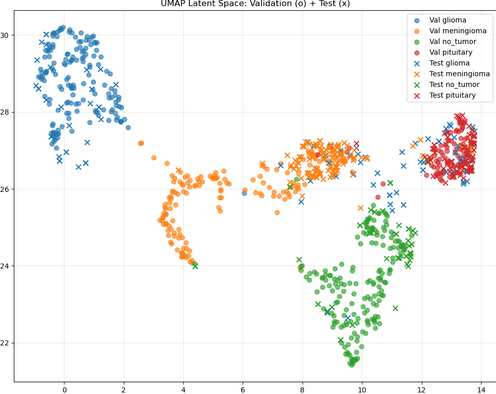

## Brain Tumor Classification: Transfer Learning vs. Multi-Task U-Net

  

This repository contains the implementation for the "Deep Learning in Visual Recognition" course project (2025). It investigates the classification of MRI scans into four categories (Meningioma, Glioma, Pituitary Adenoma, and No Tumor) using two distinct approaches: standard Transfer Learning and a custom Hierarchical Multi-Task Learning (MTL) architecture.

**Author:** Jesper F. Kallehauge  
**Institution:** Danish Centre for Particle Therapy, Aarhus University Hospital

-----

### 📖 Project Overview

Accurate tumor classification is critical for treatment planning. This project aims to diagnose tumor types solely from MRI images, simulating scenarios where biopsies are too risky.

The project explores:

1.  **Transfer Learning:** Benchmarking diverse backbones (Swin Transformer, ResNeXt, MobileNet, etc.).
2.  **Multi-Task Learning:** A U-Net based architecture that simultaneously performs:
      * Image Reconstruction (Self-Supervision)
      * Binary Tumor Detection (Tumor vs. No Tumor)
      * Subtype Classification (Specific Tumor Type).
3.  **Data Curation:** Analysis of latent space (UMAP) to identify and resolve dataset duplicates, improving accuracy from \~77% to 97%.

-----

### 🧠 Architectures

#### 1\. Transfer Learning (Warm-Start)

We finetuned several ImageNet-pretrained models to establish a baseline. The **Swin Transformer** achieved the highest validation accuracy, though **MobileNetV2** showed better generalization initially.

  * *Models tested:* VGG16, ResNeXt50, Swin-B, ViT, MobileNetV2/V3.

#### 2\. Hierarchical Multi-Task U-Net

We implemented a custom U-Net backbone that optimizes a joint objective function.

  * **Shared Encoder:** 4 downsampling blocks with increasing channel depth (64 → 1024).
  * **Reconstruction Decoder:** Restores the image to learn robust anatomical features ($L_{recon}$).
  * **Dual Classification Heads:**
      * *Binary Head:* Detects presence of tumor ($L_{bin}$).
      * *Subtype Head:* Classifies the specific type ($L_{sub}$), masked to ignore healthy inputs.

-----

### ⚖️ Adaptive Loss Balancing (EMA)

A key feature of this implementation is the **Dynamic Loss Weighting**. Instead of static hyperparameters, we use Exponential Moving Averages (EMA) to normalize loss magnitudes, ensuring no single task dominates the gradient descent.

The loss calculation (found in `epoch_run`) is defined as:

$$L_{total} = \frac{L_{recon}}{\sigma_{recon}} + \frac{L_{cls}}{\sigma_{cls}}$$

Where $\sigma$ represents the running EMA of the respective loss.

-----

### 📊 Results & The "Glioma Gap"

| Dataset Version | Model | Test Accuracy |
| :--- | :--- | :--- |
| **Dataset 1 (Raw)** | Swin Transformer | \~80.4% |
| **Dataset 1 (Raw)** | MTL U-Net | \~77.7% |
| **Dataset 2 (Cleaned)** | **MTL U-Net** | **97.33%** |

**Key Finding:** Initial experiments showed a persistent failure to classify **Gliomas** (Recall ≈ 0.33). UMAP analysis revealed a distributional shift between validation and test samples for Gliomas. After removing 1,113 duplicate images found in the combined datasets, performance stabilized significantly.

<p align="center">
  
  <br>
  <em>Figure: UMAP projection showing the shift in Glioma distribution (blue x vs blue o) before cleaning.</em>
</p>
-----

### 🛠️ Installation & Usage

1.  **Clone the repository**

    ```bash
    git clone https://github.com/Jkallehauge/DL_course_project2025.git
    cd DL_course_project2025
    ```

2.  **Install dependencies**

    ```bash
    pip install torch torchvision numpy matplotlib scikit-learn
    ```

3.  **Data Setup**

      * Dataset 1: [Kaggle Link 1](https://www.kaggle.com/datasets/sartajbhuvaji/brain-tumor-classification-mri/data)
      * Dataset 2: [Kaggle Link 2](https://www.google.com/search?q=https://www.kaggle.com/datasets/rishantenis/brain-tumor-mri-dataset/data)
      * *Note: Ensure you run the cleaning script to remove duplicates.*


### 📝 References

1.  Danish Neuro-Oncology Group (DNOG) Guidelines.
2.  Louis, D. N., et al. "The 2021 WHO Classification of Tumors of the Central Nervous System.".
3.  Ronneberger, O., et al. "U-Net: Convolutional Networks for Biomedical Image Segmentation.".
4.  Kendall, A., et al. "Multi-Task Learning Using Uncertainty to Weigh Losses.".
